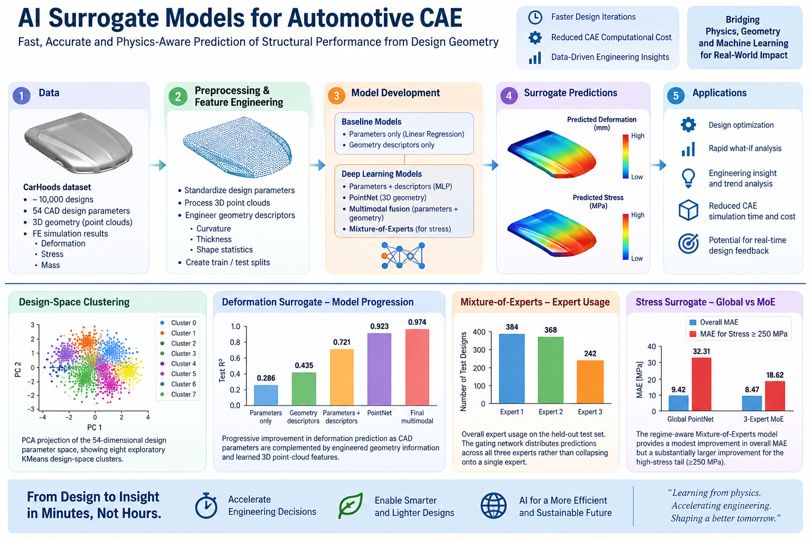
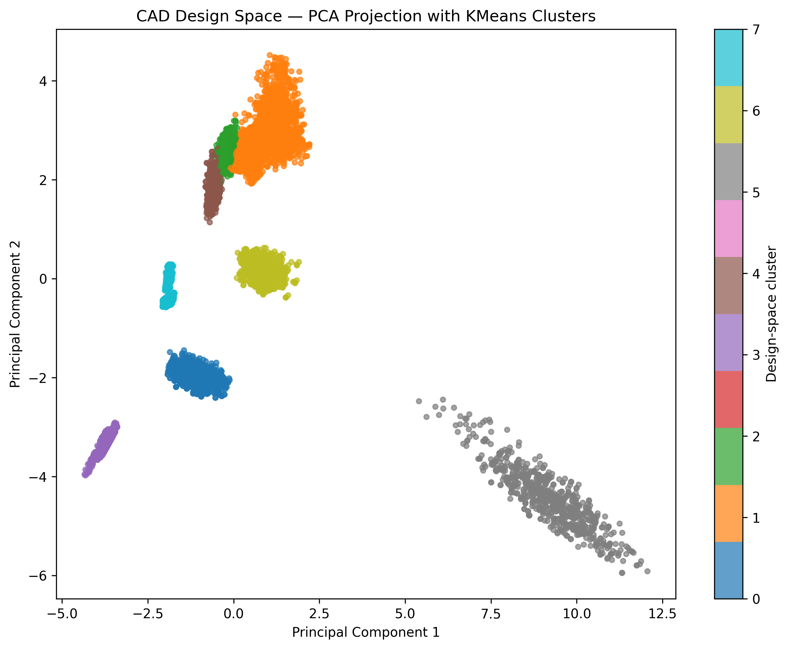
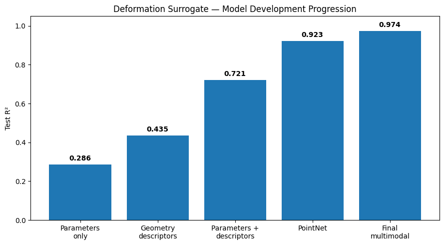
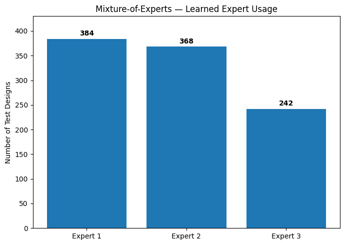
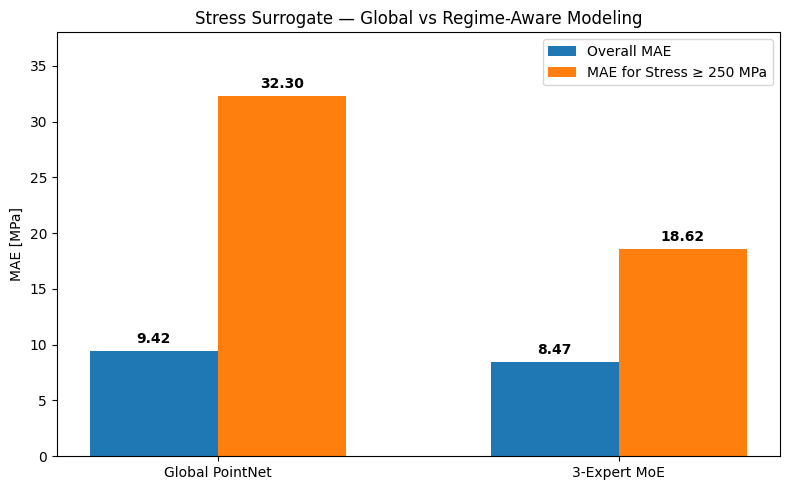

# AI-CAE-SURROGATE
AI Surrogate Model for Automotive Hood CAE
# AI-CAE Surrogate Modeling for Automotive Hood Performance



## Project Overview

Can machine learning predict the engineering performance of a new automotive design
without running the full CAE analysis?

This project investigates that question using approximately 10,000 automotive hood
designs with corresponding CAD design parameters, 3D geometry and FEA results.

The objective is to develop machine-learning surrogate models capable of predicting
structural responses directly from design information, potentially enabling rapid
design-space exploration before expensive CAE simulations are performed.

The project focuses on two structural responses:

- Maximum deformation [mm]
- Maximum Von Mises stress [MPa]

A third available response, mass [kg], is used during exploratory analysis and selected
model-development experiments.


## Engineering Problem

Traditional CAE design exploration requires repeated cycles of:

CAD Design
    ↓
Mesh / Model Preparation
    ↓
FEA Simulation
    ↓
Post-processing
    ↓
Design Modification
    ↓
Repeat

For large design spaces, this process can become computationally expensive.

A trained surrogate model provides an alternative approximation:

CAD Parameters + 3D Geometry
              ↓
        AI Surrogate
              ↓
   Predicted CAE Response

The surrogate is not intended to replace final engineering validation using FEA.

Instead, it can potentially be used to rapidly screen large numbers of design
configurations and identify promising candidates for detailed CAE evaluation.


## Dataset

The project uses the CarHoods10k dataset, containing approximately 10,000
automotive hood designs and associated finite-element simulation results.

The condensed dataset used in this project contains:

- 9,982 design records
- 54 CAD/topological design parameters
- 8,192 XYZ surface points per design
- Maximum deformation
- Maximum Von Mises stress
- Mass

After checking the point-cloud geometry, 51 records containing invalid or zero
geometry were excluded from geometry-based modeling.

This resulted in:

**9,931 valid designs**

for the main surrogate-model development.

**Original dataset:**  
CarHoods10k — Ramnath et al., Dryad  
https://doi.org/10.5061/dryad.2fqz612pt

**Preprocessed dataset used in this project:**  
CarHoods10k — 3D Point Cloud and Parametric Dataset, Samir Adli, Kaggle  
https://www.kaggle.com/datasets/samiradli/carhoods10k-3d-point-cloud-and-parametric-dataset

### Model Inputs

Each design can be represented using three complementary information sources:

1. **CAD parameters**

   54 parametric/topological design variables describing the design configuration.

2. **3D geometry**

   8,192 XYZ points representing the physical hood geometry.

3. **Engineered geometry descriptors**

   Compact geometric quantities derived from the point cloud and used in selected
   models to provide additional global geometric information.

The condensed HDF5 file does not contain authoritative names mapping every parameter
to its original CAD definition. Therefore, the parameters are retained as P1–P54
rather than assigning unsupported physical labels.


## Exploratory Analysis

Exploratory analysis showed that the CAD parameter space is highly structured.

### PCA of the CAD Parameter Space

Principal Component Analysis was performed on the standardized 54-dimensional
parameter space.

The cumulative explained variance showed:

| Explained Variance | Number of PCs |
|---|---:|
| 80% | 10 |
| 90% | 15 |
| 95% | 20 |

This indicates substantial correlation and redundancy among the original CAD
parameters.

PCA was retained as an exploratory technique rather than used to reduce the final
model inputs, since low-variance parameter combinations may still influence
structural response, particularly localized stress.


### Design-Space Clustering

The PCA projection revealed several distinct regions in the CAD design space.

KMeans clustering was therefore applied to the complete standardized
54-dimensional parameter space rather than only to PC1 and PC2.

An eight-cluster representation was retained as an interpretable exploratory
description of the design space.

These clusters are treated as data-driven design/configuration groups rather than
ground-truth topology labels.



*PCA projection of the standardized 54-dimensional CAD parameter space, showing the eight exploratory KMeans design-space clusters.*

### Engineering Insight from the Clusters

Deformation and stress exhibited noticeably different behavior across the design
space.

Mean deformation varied relatively modestly between the eight CAD clusters,
approximately from:

**9.3 mm to 10.9 mm**

Stress showed substantially stronger regime dependence in its upper tail.

One cluster contained approximately 10% of the valid designs but:

**31 of the 45 designs with stress ≥ 300 MPa**

or nearly:

**69% of the extreme-stress population.**

At the same time, most designs within that cluster were not extreme-stress cases.

This was an important observation.

It suggested that design configuration influences the probability of high stress,
but configuration alone is insufficient to determine the actual stress response.


## Modeling Strategy

The exploratory analysis suggested that deformation and peak stress should not
necessarily be treated as identical machine-learning problems.

Two separate modeling paths were therefore developed.


# Deformation Surrogate

Initial experiments using only the 54 CAD parameters showed limited predictive
capability.

Adding explicit geometric information substantially improved prediction accuracy.

The final deformation surrogate combines:

- 3D point-cloud features
- 54 CAD design parameters
- Engineered geometry descriptors

The point-cloud encoder uses shared 1D convolutions to learn features from the
physical hood geometry, followed by global pooling and fusion with the parametric
and geometric inputs.

### Final Deformation Performance

Evaluation on a held-out random design test set produced:

| Metric | Result |
|---|---:|
| R² | **0.974** |
| MAE | **0.35 mm** |
| RMSE | **0.69 mm** |

The result demonstrates that explicitly representing the resulting physical geometry
is critical for accurate deformation prediction.



*Progressive improvement in deformation prediction as CAD parameters are complemented by engineered geometry information and learned 3D point-cloud features.*


# Stress Surrogate

Peak Von Mises stress proved to be a more difficult surrogate-learning problem.

A conventional global PointNet-based regression model achieved good overall
performance, but error analysis revealed substantial underprediction in the
high-stress tail.

In particular, designs above 250–300 MPa were significantly more difficult to
predict accurately.

Rather than treating this only as a neural-network tuning problem, the high-stress
cases were investigated from an engineering perspective.


## Engineering-Guided Stress Investigation

Analysis of parameter activation patterns and geometry revealed a hierarchical
structure in the stress response.

The evidence suggested the following conceptual relationship:

**Design configuration → Geometry regime → Parameter magnitude/interactions → Stress**

Certain design families were much more likely to contain high-stress cases.

However, designs sharing the same parameter activation pattern could still produce
very different stress values.

Geometry further separated these designs into different response regimes, while
individual parameter magnitudes and interactions helped explain variation within
those regimes.

This motivated a regime-aware regression architecture rather than relying on a
single global regression function.


## Mixture-of-Experts Stress Model

The final stress surrogate uses a multimodal three-expert Mixture-of-Experts
architecture.

Inputs include:

- 3D point-cloud representation
- 54 CAD parameters
- Engineered geometry descriptors

The fused representation is passed to three regression experts.

A learned gating network determines the soft contribution of each expert to the
final stress prediction.

Importantly, the experts were not explicitly assigned to predefined stress ranges.

Specialization emerged during training.

Post-training analysis showed that the experts developed different preferences
across the stress distribution, providing evidence that the architecture learned
different response regimes from the data.



*Overall expert usage on the held-out test set. The gating network distributes predictions across all three experts rather than collapsing onto a single expert.*
## Final Stress Performance

The final model was evaluated using a target-stratified held-out test set.

| Metric | Result |
|---|---:|
| R² | **0.906** |
| MAE | **8.47 MPa** |
| RMSE | **14.05 MPa** |

Performance in the high-stress tail also improved substantially compared with the
earlier global PointNet model.

For designs with stress ≥250 MPa:

| Model | MAE | RMSE |
|---|---:|---:|
| Global PointNet | 32.31 MPa | 55.54 MPa |
| Mixture-of-Experts | **18.62 MPa** | **31.37 MPa** |

This improvement was particularly important because the high-stress designs
represented the most difficult portion of the dataset.



*The regime-aware Mixture-of-Experts model provides a modest improvement in overall MAE but a substantially larger improvement for the high-stress tail (≥250 MPa).*

## Engineering-Guided Model Development

A central objective of this project was not simply to test increasingly complex
neural-network architectures.

The modeling strategy evolved from the engineering behavior observed in the data.

The development sequence was:

**CAD-space EDA**

→ PCA revealed structured design regions

→ KMeans quantified candidate design/configuration regimes

→ high-stress designs were found to be concentrated in particular regions

→ global stress regression exposed severe high-tail underprediction

→ parameter activation families were investigated

→ geometry was found to separate response regimes within families

→ parameter magnitudes and interactions explained additional within-regime variation

→ a Mixture-of-Experts architecture was introduced to learn these different regimes.

This represents the central engineering contribution of the project:

**model architecture was selected in response to observed physical/design-space
behavior rather than solely through algorithmic experimentation.**


## Final Results

| Response | Model | R² | MAE | RMSE |
|---|---|---:|---:|---:|
| Deformation | Multimodal PointNet Fusion | **0.974** | **0.35 mm** | **0.69 mm** |
| Stress | 3-Expert Multimodal MoE | **0.906** | **8.47 MPa** | **14.05 MPa** |

The two metrics should be interpreted within their respective validation protocols.

The deformation result uses a random held-out design test set.

The final stress benchmark uses a target-stratified held-out test set designed to
retain representation of the relatively rare high-stress cases.

Neither benchmark should be interpreted as validation on completely unseen
topology families.


## Repository Structure

```text
AI-CAE-SURROGATE/
│
├── README.md
├── requirements.txt
├── .gitignore
│
├── notebooks/
│   ├── 00_CarHoods10k_PCA_EDA.ipynb
│   ├── 01_Deformation_Surrogate_REVISED.ipynb
│   └── 02_Stress_Model_Development.ipynb
│
├── src/
│   ├── data_utils.py
│   ├── geometry_features.py
│   ├── pointnet.py
│   └── stress_moe.py
│
├── results/
│   ├── deformation_metrics.csv
│   └── stress_metrics.csv
│
├── images/
│
└── data/
    └── README.md